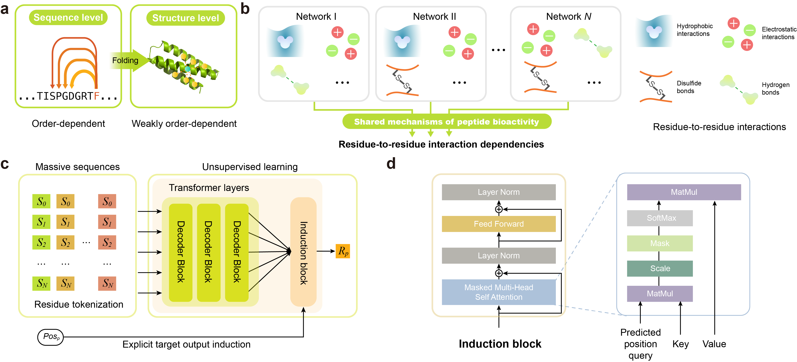

# PepGenWOA

The official code repository of "Peptide generative design with weakly order-dependent autoregressive language model and lifelong learning".


## Table of Contents

- [Overview](#overview)
- [Requirements](#requirements)
- [Instructions for Use](#instructions-for-use)
- - [Data Preparation](#data-preparation)
- - [Model Pretraining](#model-pretraining)
- - [Finetuning on Your Data](#finetuning-on-your-data)
- - [Peptide Generation](#peptide-generation)
-  - [Visualization of the Synthetic Sequence Space](#visualization-of-the-reduced-distribution-space)
- [Pretrained and Finetuned Models Availability](#pretrained-and-finetuned-models-availability)


# Overview

Bioactive peptides have become strong candidates for a variety of clinical therapies due to their diverse advantages, which promotes the development of deep generative models for peptide design. Considering that existing methods cannot effectively deal with the conformational flexibility of peptides and are difficult to capture accurate residue-to-residue interaction dependencies, we propose a unified weakly order-dependent autoregressive language modeling architecture (PepGenWOA) for bioactive peptide generative design with tolerating out-of-order input as inductive bias. The superiority of PepGenWOA is demonstrated by generating three classes of therapeutic peptides, including antimicrobial peptides, anticancer peptides, and peptide binders. For antimicrobial and anticancer peptide generation, PepGenWOA not only comprehensively outperforms state-of-the-art baseline models, but also exhibits a significant propensity to incorporate specific types of residues that are beneficial for antimicrobial or anticancer bioactivity. For characteristic-guided peptide binder generation, the pretrained PepGenWOA is fine-tuned with Mixture-of-Experts-style plugins with lifelong learning paradigm, thereby achieving the best trade-off between memory stability for world knowledge and learning plasticity for new downstream tasks. The subsequent structure-based virtual screening anchors the 7 most promising candidates from the mega-scale synthetic sequence space, reducing the number of candidates for in vitro experimental validation by 5 orders of magnitude. A target binding rate of 28.6% with binding specificity further confirms the effectiveness of the fine-tuning strategy. Overall, PepGenWOA is a unified architecture for peptide generative design that can be flexibly customized for different task requirements, thereby harnessing generative language models to reach the "dark space" of biological language.


# Requirements

[mindspore](https://www.mindspore.cn/en) >=1.5.

**!! NOTE: Pretraining and fine-tuning of our generative protein language model, and peptide generation are conducted on **Ascend-910 (32GB)** with MindSpore. If you use a GPU, please follow the instructions on [MindSpore's official website](https://www.mindspore.cn/en) to install the GPU-adapted version.**


#  Instructions for Use


## Data Preparation


The antimicrobial peptide and anticancer peptide dataset is publicly available from [a previous study](https://ojs.aaai.org/index.php/AAAI/article/view/27749).
The pretraining dataset for peptide binder generation can be obtained from [BFD](https://bfd.mmseqs.com/), [Pfam](http://pfam.xfam.org/) and [UniProt](https://www.uniprot.org/).
The miniprotein scaffold dataset for fine-tuning is also publicly available from [a previous study](https://files.ipd.uw.edu/pub/robust_de_novo_design_minibinders_2021/supplemental_files/scaffolds.tar.gz).

After data filtering and processing is completed, convert it to a txt format in which a line means a sequence.

Structure your data directory as follows:

```plaintext
your_data_dir/
  ├─01.txt
  ...
  └─09.txt
```

Convert the dataset to MindRecord format using:

```shell
python prepare_data.py --data_url your_data_dir --save_dir your_save_dir
```

## Model Pretraining

Initiate pretraining with:

```shell
python train.py --train_url your_data_dir
```

**Note:** This code is tested on Pengcheng CloudBrain II (Ascend-910). Modifications may be needed for other environments.


## Finetuning on Your Data

To finetune the pretrained model on your dataset:

```shell
python train.py --train_url your_data_dir --load_ckpt_path pretrained_ckpt_path --finetune
```

## Peptide Generation

Generate peptides by specifying the checkpoint path:

```shell
python generate_peptide.py --head_txt your_template_peptide --load_ckpt_path pretrained_ckpt_path
```


## Visualization of the Synthetic Sequence Space


To demonstrate whether static structure-based virtual screening directionally shrinks the synthetic sequence space, we visualize the synthetic space of the remained candidates in different screening stages with sequence-based protein descriptors and factor analysis.
Considering that combining multiple protein descriptors allows us to gain a more comprehensive representation of the underlying patterns of peptide binder sequences, we employ multiple length-independent descriptors ($k$-mer spectra, Normalized Moreau-Broto Autocorrelation descriptor, Quasi-sequence-order descriptor, Composition, Transition, and Distribution descriptor) to ensure that sequences of different lengths have equal-length descriptor vectors.
All the descriptors are finally concatenated together for factor analysis.


  - get_descriptor.py                # Script to extract descriptors from protein sequences
  -  vis.py                           # Script for visualizing descriptors
  -  example.sh                       # Example shell script to demonstrate descriptor extraction and visualization


# Pretrained and Finetuned Models Availability

Pretrained model for peptide binder generation can be download [here](https://figshare.com/ndownloader/files/51780113).
Finetuned model for peptide binder generation can be download [here](https://figshare.com/ndownloader/files/51780110).

